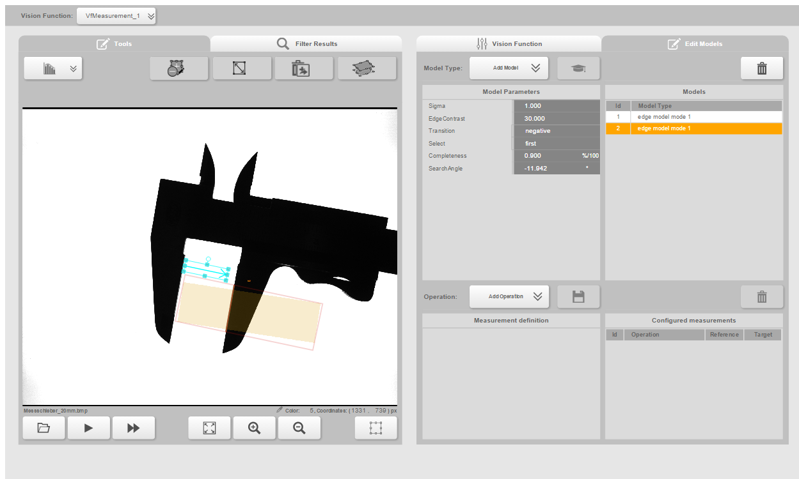

# Caliper

The following functions can be tested with this caliper:
* Alignment with Matching and Measurement
* Fast Forward (in the Offline-HMI)

# Images
A caliper lies on a B&R backlight. Only the backlight LEDs are used.

# Description
There are several images of the caliper with different set-distances.

# Vision Application
The vision functions Matching and Measurement can be combined with Alignment.

# Sample usage
Teach the top-part of the caliper

Teach both edges

With the second edge be careful to use a "long" ROI to find also opened and colosed calipers

Define an operation. Here "orthogonal distance" is used.

Result:

## Fast Forward
The Fast Forwart function of the offline HMI can be used to check if the parameters are right and every image in the folder can be measured.
In the resultig csv-File it is easy to use the 20mm teached caliper as a reference and calculate the distance of the other calipers.

>If you calculate the distances e.g. in Excel for all images, you will notice some deviations. The reason for this is that the caliper does not lie exactly on the surface of the backlight in every image.

# Authors
Samuel Otto, B&R Industrie Elektronik GmbH