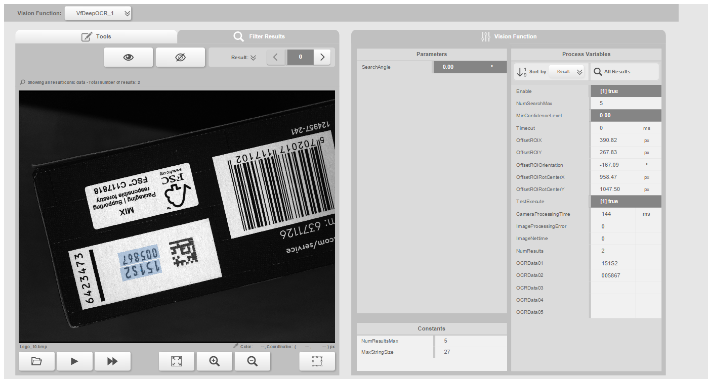

# Lego-Box

The following functions can be tested with this Lego-Box:
* Alignment with CodeReader and DeepOCR, optional Matching
* Fast Forward (in the Offline-HMI)

# Images
A Lego Box with a printed Data Matrix Code and text is in the image in different positions and orientations

# Vision Application
The vision functions CodeReader and DeepOCR can be combined with Alignment.

# Sample usage
Set the parameters for CodeReader (DataMatrix-Code)

Set two ROIs for the printed texts. The two ROIs are not allowed to touch each other.

Result: The texts can be found in any orientation of the box. The ROI will be shifted and rotated with Alignment.

Optional: Teach the tree with Matching:

## Fast Forward
The Fast Forward function of the offline HMI can be used to check if the printed text will be found in every image.

# Authors
Samuel Otto, B&R Industrie Elektronik GmbH